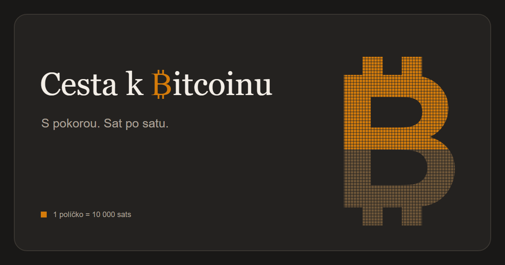

Jednoduchá statická stránka pro sledování bitcoinového cíle. Sečte zůstatky adres a zobrazí je jako bitcoinové logo z 10 000 políček. Nastav si cíl v BTC, každé políčko představuje jeho jednu desetitisícinu.

Stránku si můžeš prohlédnout [zde](https://safiron8.github.io/BitcoinJourney/).

[English](README.md)

## Jak to funguje

Na stránce vložíš bitcoinovou adresu. Zůstatky se sečtou a zobrazí jako vyplněné logo, procenta a částka zbývající do cíle.

V nastavení můžeš změnit cíl, přidat vlastní motivační hlášku nebo skrýt části stránky.

## Zůstatky a soukromí

Adresy, nastavení a zůstatky adres se ukládají lokálně ve tvém prohlížeči. Stránka nemá vlastní backend. Pro zjištění zůstatků se adresy posílají na [mempool.space](https://mempool.space/), v nastavení můžeš zvolit jiné kompatibilní API.

## Inspirace

Inspirací byla [výzva uživatele u/na7oul na r/Bitcoin](https://www.reddit.com/r/Bitcoin/comments/1wjtwlj/want_to_become_a_full_coiner_this_challenge_is/).

## Licence

Tento projekt je dostupný pod licencí MIT.

## O Bitcoinu

Zajímá tě, proč mě bitcoin tolik zaujal, začni na [Proč Bitcoin?](https://ProcBitcoin.cz/?aff=tltlc)  
Chceš se o něm dozvědět víc? Mrkni do [Atlasu Bitcoinera](https://stosuj.cz/atlas?aff=tltlc)  
A pokud chceš stackovat saty, můžeš využít [Štosuj.cz](https://stosuj.cz/?aff=tltlc)

Tyto odkazy jsou affiliate. Pokud se přes ně zaregistruješ, můžu získat provizi a podpoříš tím mě i tenhle projekt. Pokud nejsi fanoušek affiliate odkazů, tady jsou stejné stránky bez nich. Díky, že se zajímáš o Bitcoin.

[Proč Bitcoin?](https://ProcBitcoin.cz/) · [Atlas Bitcoinera](https://stosuj.cz/atlas) · [Štosuj.cz](https://stosuj.cz/)
