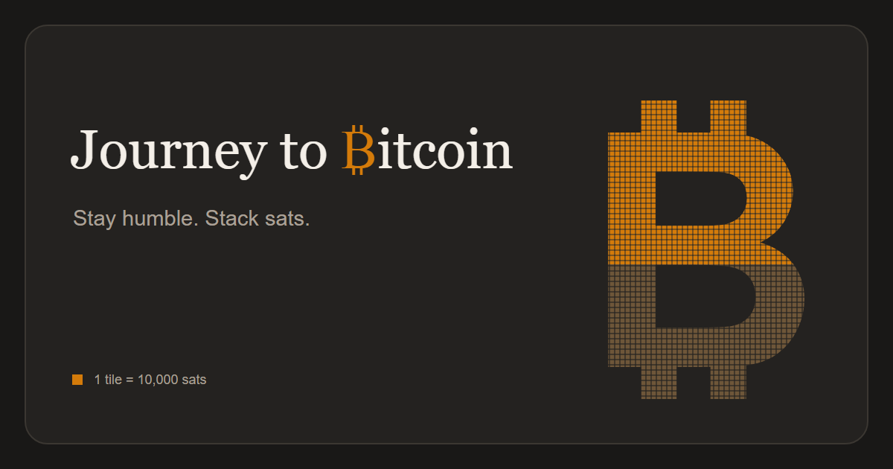

A simple static page for tracking your Bitcoin goal. It adds up the balances of your addresses and displays them as a Bitcoin logo made up of 10,000 tiles. Set your target in BTC, and each tile represents one ten-thousandth of that goal.

You can check out the page [here](https://safiron8.github.io/BitcoinJourney/).

[Česky](README.cs.md)

## How it works

Enter a Bitcoin address on the page. The balances are added together and displayed as a filled Bitcoin logo, along with your progress percentage and the amount remaining to reach your goal.

In the settings, you can change your goal, add your own motivational message, or hide parts of the page.

## Balances and privacy

Your addresses, settings, and address balances are stored locally in your browser. The page has no backend of its own. To retrieve balances, addresses are sent to [mempool.space](https://mempool.space/). You can choose a different compatible API in the settings.

## Inspiration

Inspired by [u/na7oul's full-coiner challenge on r/Bitcoin](https://www.reddit.com/r/Bitcoin/comments/1wjtwlj/want_to_become_a_full_coiner_this_challenge_is/).

## License

This project is licensed under the MIT License.
